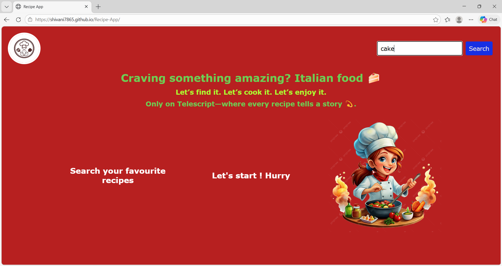
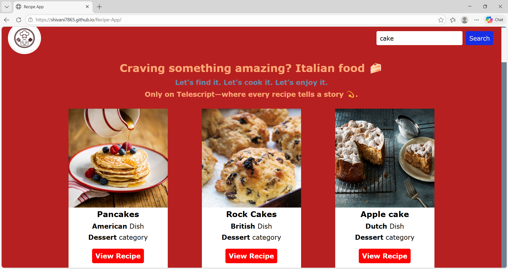
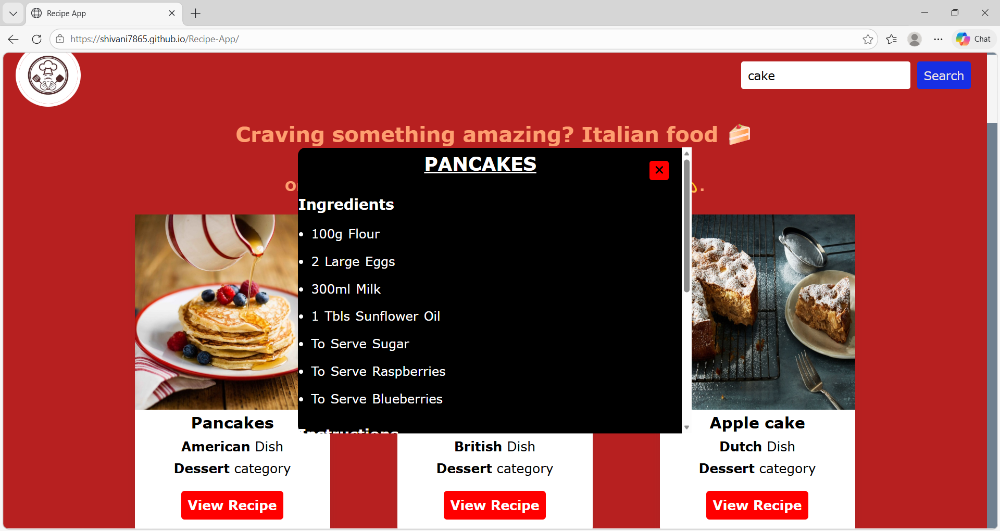
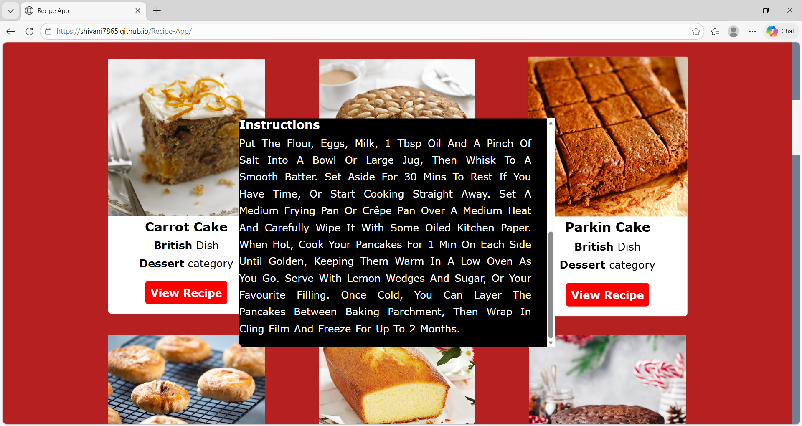

# 🍲 Recipe App

A simple recipe search web app using TheMealDB API.

## 🚀 Features
- Search recipes by name
- View ingredients and instructions
- Clean UI with animations

## 🛠️ Tech Stack
- HTML
- CSS
- JavaScript
- API: TheMealDB

## 🔗 Live Demo
https://shivani7865.github.io/Recipe-App/

## 📂 Project Structure
- index.html
- style.css
- script.js

## 📸 Screenshots

  

  

  

  

  

